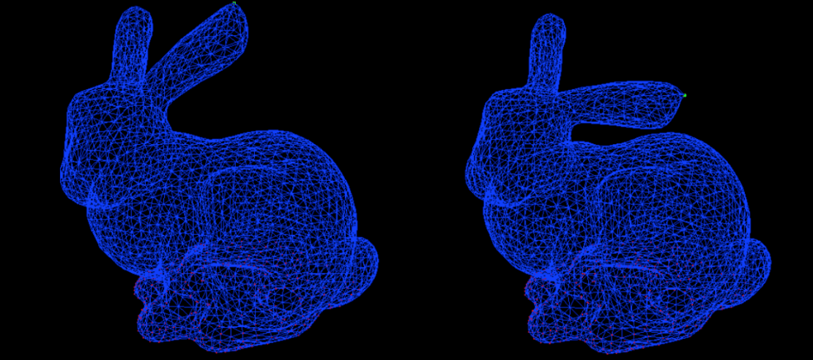

# deformation
Implements As-Rigid-As-Possible (ARAP) Surface Modeling by Sorkine et al. to deform models while minimizing stretching or shearing.

Note: Requires Eigen 3.2.4 and assumes it is in /usr/local/Cellar/eigen/3.2.4/include/eigen3/
